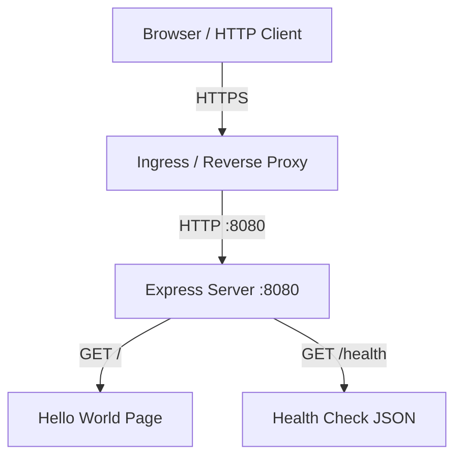

# Architecture

## Overview

A minimal Hello World web application using Node.js/Express with TypeScript. The application serves a styled HTML page and exposes a health check endpoint. It is containerized via Docker for production deployment.

## System Design

## Components

### Express Server (`src/index.ts`)

Single entry point that:
1. Creates an Express application
2. Registers route handlers for `/` and `/health`
3. Starts listening on port 8080

### Routes

| Route | Method | Response |
|-------|--------|----------|
| `/` | GET | HTML page with Hello World heading and clean CSS |
| `/health` | GET | JSON `{ "status": "ok" }` with HTTP 200 |

## Data Flow

1. HTTP request arrives at port 8080
2. Express router matches the path
3. Route handler returns the appropriate response (HTML or JSON)
4. No external services, databases, or state involved

## Deployment

- Multi-stage Dockerfile: build TypeScript in stage 1, run with minimal Node.js image in stage 2
- Container exposes port 8080
- Expected to run behind an ingress/reverse proxy for TLS termination
