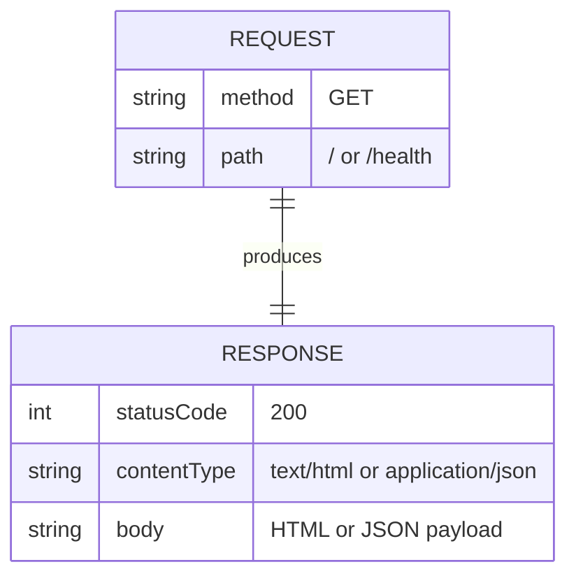

# Data Model

## Overview

This application has no persistent data model. It is a stateless HTTP server that returns static responses.

## Entities

### HTTP Request (transient)

| Field | Type | Description |
|-------|------|-------------|
| method | string | HTTP method (GET) |
| path | string | Request path (/, /health) |

### HTTP Response (transient)

| Field | Type | Description |
|-------|------|-------------|
| statusCode | number | HTTP status code (200) |
| contentType | string | Response MIME type |
| body | string | Response payload (HTML or JSON) |

## Relationships

- No database tables, no persistent storage
- No entity relationships beyond request-response mapping
